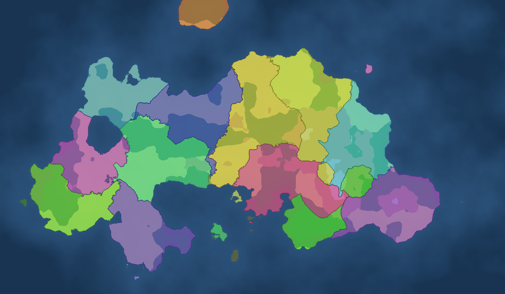

# PSX Modeler

Claude destekli, tek dosyalık (`index.html`, bağımlılık yok) PS1 tarzı low-poly modelleme aracı.

Aç: `index.html`'i tarayıcıda aç (sürükle = döndür, tekerlek = zoom).

## Neden az token?
Claude mesh/koordinat listesi yerine ~10 komutluk mini bir dil yazar; texture'lar prosedürel üretilir (piksel verisi yok):

```
tex brick bricks 16 #b55 #633
box 3 1 -2 2.4 2 2 brick
cone 3 2.6 -2 1.9 1.2 4 wood ry=45
box .2 .35 0 .3 .7 .3 pants mx     # mx = x ekseninde yansıma kopyası
```
Tipik bir istek ~250 token sistem istemi + birkaç yüz token çıktı. "Mevcut modeli gönder" kapalıyken girdi daha da küçülür.

## Kullanım
- **API ile**: Ayarlar'a Anthropic anahtarını gir (sadece tarayıcında saklanır), "Claude ile üret".
- **API'siz**: "İstemi kopyala" → claude.ai'ye yapıştır → cevabı kod kutusuna yapıştır.
- Çıktı: OBJ + MTL + texture PNG'leri.

## PSX görünümü
320x240, vertex snapping (piksel titremesi), affine (perspektifsiz) texture, nearest filtre, 4x4 dither, 15-bit renk.

## Taban gövde: "The Ward"
Büyücüler, kullanıcının yüklediği `assets/Karakter_UE5.fbx` (The Ward low-poly karakteri, 537 vertex / 1046 üçgen, UE5 iskeleti) üzerinde kurulur.
`assets/ward.js` bu FBX'ten çıkarılmış mesh'tir (Z-yukarı cm → Y-yukarı m, yüzü +z'ye bakar, T-pose, boy 1.8 m, ayaklar y=0).

```
mesh ward X Y Z OLCEK DERI UST BACAK BOT
```
Gruplar kemik ağırlıklarından türetildi: DERI = kafa/boyun/eller, UST = gövde/kollar, BACAK, BOT.
Üstüne şapka, sakal, asa gibi primitive'ler eklenir.

> Lisans: Orijinal "The Ward" OpenGameArt'taki lisansına tabidir (https://opengameart.org/content/the-ward-low-poly-character). CC-BY ise yaratıcıya atıf gerekir; yayınlamadan önce sayfadaki lisansı kontrol edin.

---

# Keladam — Büyülü Orta Çağ Toprak Savaşı (tasarım aşaması)

OpenFront.io'dan esinlenen, sıfırdan yazılacak, Windows/Steam oyunu.

- [01 — OpenFront.io Analizi](docs/01-OpenFront-Analizi.md)
- [02 — Oyun Tasarım Belgesi](docs/02-Oyun-Tasarimi.md)
- [03 — Teknik Mimari (Steam + Windows)](docs/03-Teknik-Mimari.md)

## M0 prototipi (tek oyunculu, Godot 4.7 + C#)



| Klasör | İçerik |
|---|---|
| `src/Keladam.Core` | Deterministik simülasyon (motor bağımsız, kayan nokta yok) |
| `tests/Keladam.Core.Tests` | Birim + determinizm/replay testleri |
| `tools/Keladam.Sim` | Ekransız yapay zekâ maçı → PNG |
| `game/` | Godot projesi (shader ile harita, arayüz, kamera) |

**Çalıştırma**
1. [.NET 8 SDK](https://dotnet.microsoft.com/download/dotnet/8.0) ve **Godot 4.7 .NET** sürümünü kurun.
2. Godot'ta `game/project.godot`'u açın → F5.
3. Testler: `dotnet test` · Ekransız maç: `dotnet run -c Release --project tools/Keladam.Sim -- <tohum> <tick> out/sim.png`

**Kontroller**
- İlk 15 sn: haritaya tıkla → başlangıç yeri.
- Sol tık: tıklanan diyara (ya da sahipsiz araziye) saldır. Aynı hedefe tekrar tıklamak cepheye asker ekler.
- Saldırı oranı: alttaki kaydırıcı veya `1`–`9` tuşları (%10–%90).
- Kamera: sağ/orta tuşla sürükle, tekerlek yakınlaştır, WASD/ok tuşları; `Space` kendi diyarına git.
- `P` duraklat, `+`/`-` oyun hızı, `F5` yeni harita.

Windows .exe: Godot → Proje → Dışa Aktar → Windows Desktop (export şablonlarını Godot indirir).
